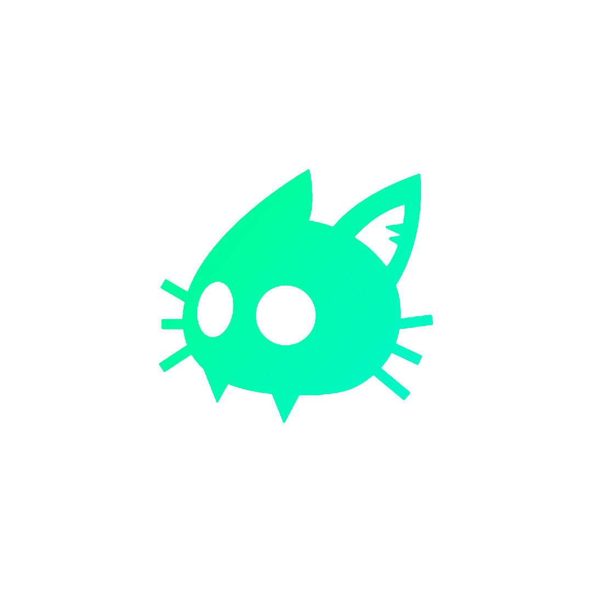

<!-- Improved compatibility of back to top link: See: https://github.com/othneildrew/Best-README-Template/pull/73 -->

<!--
*** Thanks for checking out the Best-README-Template. If you have a suggestion
*** that would make this better, please fork the repo and create a pull request
*** or simply open an issue with the tag "enhancement".
*** Don't forget to give the project a star!
*** Thanks again! Now go create something AMAZING! :D
-->

<!-- PROJECT SHIELDS -->
<!--
*** I'm using markdown "reference style" links for readability.
*** Reference links are enclosed in brackets [ ] instead of parentheses ( ).
*** See the bottom of this document for the declaration of the reference variables
*** for contributors-url, forks-url, etc. This is an optional, concise syntax you may use.
*** https://www.markdownguide.org/basic-syntax/#reference-style-links
-->
[![Contributors][contributors-shield]][https://github.com/vowxky/Vox-Studio-Launch/graphs/contributors]
[![MIT License][license-shield]][license-url]

<!-- PROJECT LOGO -->
 

  

  <h3 align="center">Vox Launch</h3>

  

    Un Launcher hecho para jugar minecraft con archivos modificados
  

<!-- TABLE OF CONTENTS -->

  
Tabla del contenido

  <ol>
    <li>
      <a href="#about-the-project">Acerca del launcher</a>
      <ul>
        <li><a href="#built-with">Built With</a></li>
      </ul>
    </li>
    <li>
      <a href="#getting-started">Getting Started</a>
      <ul>
        <li><a href="#prerequisites">Prerequisites</a></li>
        <li><a href="#installation">Installation</a></li>
      </ul>
    </li>
    <li><a href="#usage">Usage</a></li>
    <li><a href="#roadmap">Roadmap</a></li>
    <li><a href="#contributing">Contributing</a></li>
    <li><a href="#license">License</a></li>
    <li><a href="#contact">Contact</a></li>
    <li><a href="#acknowledgments">Acknowledgments</a></li>
  </ol>

<!-- ABOUT THE PROJECT -->
## Acerca del launcher

[![Product Name Screen Shot][https://raw.githubusercontent.com/vowxky/Vox-Studio-Launch/main/readme-images/background-launcher.PNG]](https://raw.githubusercontent.com/vowxky/Vox-Studio-Launch/main/readme-images/background-launcher.PNG)

El launcher esta creado en electron.js basado en codigo de html , css y javascript

Here's why:
* No tiene virus y a pasado por 60 anti virus verificados por virustotal
* Completamente practico de usar

### Built With

This section should list any major frameworks/libraries used to bootstrap your project. Leave any add-ons/plugins for the acknowledgements section. Here are a few examples.

* [![React][React.js]][React-url]
* [![Bootstrap][Bootstrap.com]][Bootstrap-url]

<!-- LICENSE -->
## Licencia

Distribuida con la licencia de MIT. Puedes verlo aqui `LICENSE.txt` para mas informacion.

<!-- CONTACT -->
## Contacto

 - [Server WEB](https://VoxStudios.vowxky.repl.co) - voxstudios.com@gmail.com

Link del proyecto: [https://github.com/vowxky/Vox-Studio-Launch.git](https://github.com/vowxky/Vox-Studio-Launch.git)
